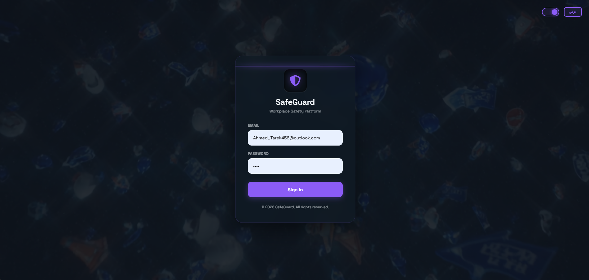
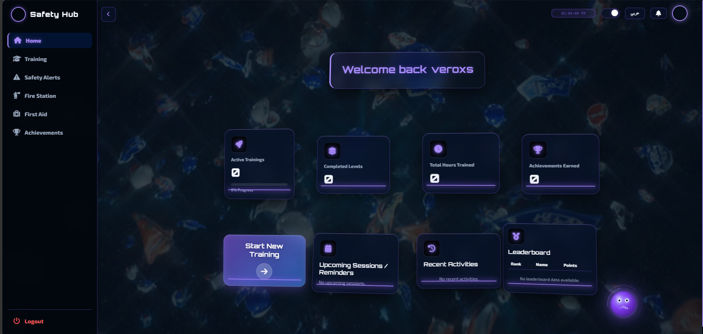
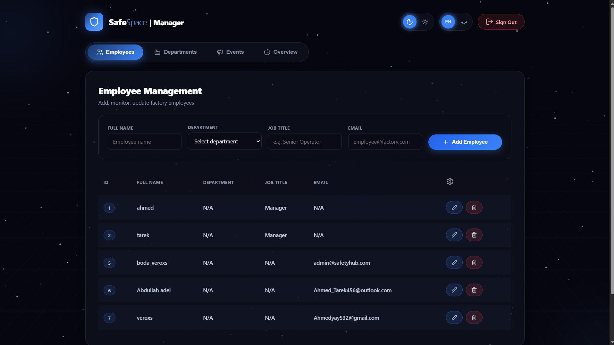
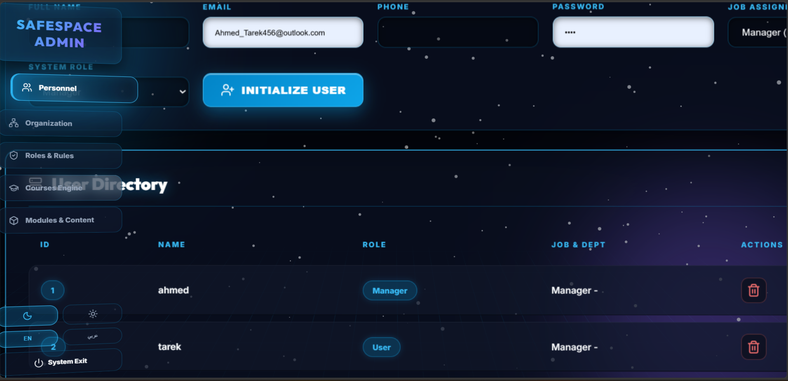
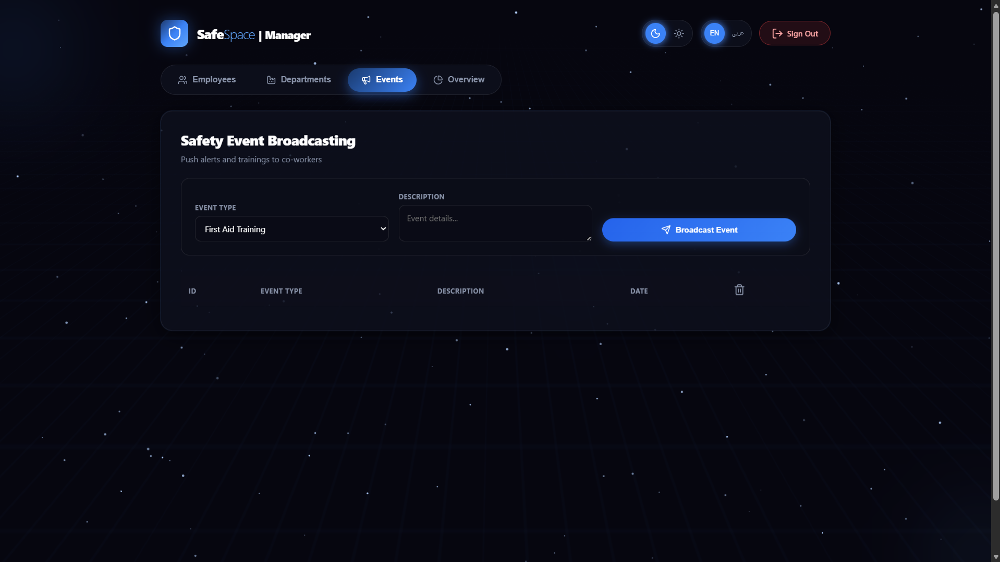
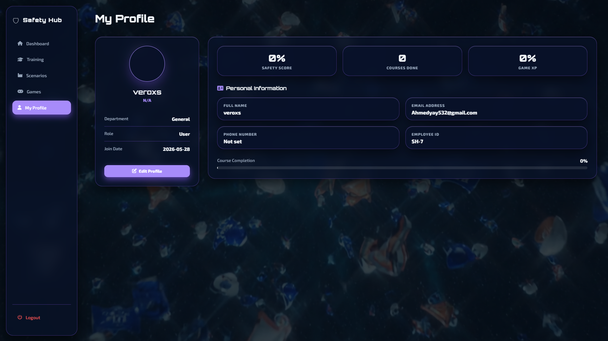

# Interactive Safety Workspace Platform

A web-based platform designed to help organizations manage workplace safety training, employee progress, safety events, and department management — all from a single, easy-to-use interface.


## Table of Contents

1. [What is This Project?](#what-is-this-project)
2. [Who is it For?](#who-is-it-for)
3. [Features Overview](#features-overview)
4. [Project Structure](#project-structure)
5. [Technologies Used](#technologies-used)
6. [Prerequisites (What You Need Before You Start)](#prerequisites-what-you-need-before-you-start)
7. [How to Set Up the Database](#how-to-set-up-the-database)
8. [How to Configure the Application](#how-to-configure-the-application)
9. [How to Run the Project](#how-to-run-the-project)
10. [How to Use the Platform](#how-to-use-the-platform)
11. [User Roles Explained](#user-roles-explained)
12. [Pages and What They Do](#pages-and-what-they-do)
13. [API Endpoints Reference](#api-endpoints-reference)
14. [Default Accounts (Seed Data)](#default-accounts-seed-data)
15. [Important Notes & Known Limitations](#important-notes--known-limitations)
16. [Troubleshooting](#troubleshooting)

---

## What is This Project?

The **Interactive Safety Workspace Platform** (also referred to internally as *SafetyHub*) is a full-stack web application built with Java and Spring Boot. It provides a centralized workspace where:

- **Employees** can access safety training courses, view their progress, and check safety events.
- **Managers** can register new employees, manage departments, issue warnings, and monitor their team.
- **Admins** have full control over every part of the system — users, roles, departments, jobs, courses, and more.

Think of it as an internal company portal focused entirely on workplace safety and training management.

---

## Who is it For?

This platform is intended for organizations that want to:

- Track employee safety training completion.
- Manage safety-related events and alerts.
- Organize employees across departments and job roles.
- Give managers a dedicated dashboard to oversee their teams.
- Give administrators full control over all system data.

---

## Features Overview

- **Role-based access control** — Three user roles (Admin, Manager, Employee/User), each with a different set of permissions and a dedicated interface.
- **Employee dashboard** — Displays stats, course listings, achievements, and reports for regular employees.
- **Manager dashboard** — A tabbed interface for managing employees, departments, and team activity.
- **Admin panel** — A full CRUD (Create, Read, Update, Delete) interface for every entity in the system.
- **Safety events system** — Create, filter, and track safety events by type (Training, Warning, etc.) with real-time notification polling.
- **User profiles** — Employees can update their personal information and upload a profile picture.
- **Training pages** — Static pages covering fire safety, first aid, safety alerts, and training scenarios.
- **Warning system** — Managers can issue warnings to employees. After 3 warnings, the employee is automatically removed from the system.

---

## Project Structure

Below is a simplified overview of how the project files are organized:

```
/
├── src/
│   └── main/
│       ├── java/com/saftyhub/project1/
│       │   ├── controller/        ← Handles incoming web requests
│       │   ├── dto/               ← Data Transfer Objects (data shapes)
│       │   ├── exception/         ← Error handling
│       │   ├── model/             ← Database table definitions
│       │   ├── repository/        ← Database queries
│       │   └── services/          ← Business logic
│       └── resources/
│           ├── application.properties   ← Main configuration file
│           ├── static/
│           │   ├── css/           ← Stylesheets
│           │   ├── js/            ← JavaScript files
│           │   ├── uploads/avatars/  ← User profile pictures (auto-generated)
│           │   └── videos/        ← Background videos
│           └── templates/
│               ├── pages/         ← Main pages (dashboard, events, profile...)
│               └── fragments/     ← Shared layout components (sidebar, topbar...)
├── ai_service/                    ← AI-related service (separate module)
├── website/                       ← Additional frontend assets
├── pom.xml                        ← Project dependencies and build config
├── mvnw / mvnw.cmd                ← Maven wrapper scripts (run Maven without installing it)
└── start_all.bat                  ← Windows script to start everything at once
```

---

## Technologies Used

You do not need to be an expert in any of these to run the project, but here is what is used under the hood:

| Technology | What it does |
|---|---|
| **Java 17** | The main programming language |
| **Spring Boot 3.5.7** | The framework that powers the backend |
| **Thymeleaf** | Generates the HTML pages on the server side |
| **MySQL** | The database that stores all data |
| **Spring Data JPA** | Makes it easy to read and write to the database |
| **Maven** | Manages project dependencies and builds |
| **Lombok** | Reduces boilerplate Java code |
| **HTML / CSS / JavaScript** | The frontend (what the user sees in the browser) |

---

## Prerequisites (What You Need Before You Start)

Before running this project, you need to have the following installed on your computer:

### 1. Java 17 or Higher

Java is the programming language this project is written in. You need it to run the application.

- Download from: https://adoptium.net/
- After installing, verify it works by opening a terminal and typing:
  ```
  java -version
  ```
  You should see something like `openjdk version "17.x.x"`.

### 2. MySQL (Version 8 or Higher)

MySQL is the database system the project uses to store all data.

- Download from: https://dev.mysql.com/downloads/mysql/
- During installation, you will be asked to set a **root password**. Remember this password — you will need it later.
- Alternatively, you can use **XAMPP** (https://www.apachefriends.org/) which includes MySQL and is easier to set up for beginners.

### 3. Maven (Optional — the project includes its own)

Maven is the build tool. The project already includes a Maven wrapper (`mvnw` on Mac/Linux, `mvnw.cmd` on Windows), so you do not strictly need to install Maven separately. However, if you prefer, you can install it from https://maven.apache.org/.

### 4. Git (to download the project)

- Download from: https://git-scm.com/
- Or you can simply download the project as a ZIP file from GitHub.

---

## How to Set Up the Database

### Step 1: Create the Database

Open your MySQL client (command line, MySQL Workbench, or phpMyAdmin) and run the following command:

```sql
CREATE DATABASE safety_workspace;
```

That is all you need to do. The application will automatically create all the necessary tables when it starts for the first time.

### Step 2: Make Sure MySQL is Running

Ensure your MySQL server is running before you start the application. If you installed XAMPP, start it from the XAMPP Control Panel.

---

## How to Configure the Application

Open the file located at:

```
src/main/resources/application.properties
```

You will find settings that look like this:

```properties
spring.datasource.url=jdbc:mysql://localhost:3306/safety_workspace
spring.datasource.username=root
spring.datasource.password=YOUR_PASSWORD_HERE
```

Replace `YOUR_PASSWORD_HERE` with the MySQL root password you set during installation.

> ⚠️ **Security Note:** Do not share this file publicly or push it to GitHub with real credentials. It contains your database password. For production use, it is strongly recommended to move these values to environment variables.

The server runs on **port 8080** by default. You can change this by adding the following line to the same file:

```properties
server.port=9090
```

---

## How to Run the Project

### Step 1: Download the Project

Either clone it using Git:

```bash
git clone https://github.com/AhmedTarekOfficial/Interactive-Safety-Workspace-platform.git
cd Interactive-Safety-Workspace-platform
```

Or download it as a ZIP from GitHub and extract it.

### Step 2: Configure the Database

Follow the steps in the [How to Configure the Application](#how-to-configure-the-application) section above.

### Step 3: Start the Application

**On Windows**, you can double-click the `start_all.bat` file, or run in the terminal:

```cmd
mvnw.cmd spring-boot:run
```

**On Mac or Linux**, run:

```bash
./mvnw spring-boot:run
```

The first time you run this, Maven will download all the necessary libraries. This may take a few minutes depending on your internet connection.

### Step 4: Open the Application

Once you see a message like `Started Project1Application in X seconds` in the terminal, open your web browser and go to:

```
http://localhost:8080
```

You should see the login page.

---

## How to Use the Platform

### Logging In

Go to `http://localhost:8080` and log in with one of the default accounts (see [Default Accounts](#default-accounts-seed-data) below).

### After Login

The system will automatically redirect you to the correct page based on your role:
- **Admin** → Admin Panel (`/admin`)
- **Manager** → Manager Dashboard (`/manager/dashboard`)
- **Employee** → Employee Dashboard (`/dashboard`)

### Logging Out

Click the logout button in the navigation bar, or go to:
```
http://localhost:8080/logout
```

---

## User Roles Explained

The platform has three distinct roles, each with different access levels:

### 👤 Employee (User)

The default role for most users. Employees can:
- View their personal dashboard with stats and progress.
- Browse available safety training courses.
- View safety events and notifications.
- Access training materials (fire safety, first aid, scenarios).
- Update their profile and upload a profile picture.

### 👔 Manager

Managers have additional capabilities on top of the employee features:
- Access a dedicated Manager Dashboard with multiple tabs.
- Register new employees into the system.
- Edit and delete employee accounts.
- Manage departments (create, update, delete).
- Issue warnings to employees. After 3 warnings, the employee is automatically removed.
- View detailed employee profiles.

### 🔧 Admin

Admins have full access to the entire system:
- Manage all users (employees and managers).
- Assign and remove roles.
- Manage all departments and job positions.
- Manage all training courses, categories, modules, and videos.
- Access all system data from a single admin panel.

---

## Pages and What They Do

### Login Page — `/`

The entry point of the application. Users enter their email and password to log in. The system redirects them to the appropriate dashboard based on their role.





### Employee Dashboard — `/dashboard`

The main page for regular employees. Shows a summary of:
- Total number of employees in the system.
- Quick navigation to courses, games, achievements, and reports.
- A list of employees with search and filter capabilities.

---


---

### Employees List — `/employees`

A page showing all employees as cards, along with their current status counts. Managers are redirected away from this page to their own interface.

### Employee Detail — `/employees/{id}/detail`

Displays detailed information about a specific employee, including their job, department, and course enrollment.

### Courses — `/courses`

Lists all available safety training courses.

### Games — `/games`

Interactive safety-related games or activities.

### Achievements — `/achievements`

Displays earned achievements and milestones.

### Reports — `/reports`

Shows statistics and reports related to employee activity and training.

---

### Manager Dashboard — `/manager/dashboard`

A tabbed interface exclusively for managers. Tabs include:
- **Overview** — General statistics and charts.
- **Employees** — Add, edit, and delete employee records.
- **Departments** — Create and manage departments.

From this page, managers can also issue warnings to employees directly.

---

---

### Admin Panel — `/admin`

The most powerful page in the system, accessible only to Admins. Contains tabs for managing every part of the system:
- Users (Managers and Employees)
- Roles
- Departments
- Job Positions
- Training Courses
- Course Categories
- Course Modules
- Module Videos

---

---

### Safety Events — `/events`

A page where safety events are created, viewed, and managed. Events can be filtered by type:
- **ALL** — Show everything.
- **TRAINING** — Training-related events.
- **WARNING** — Warning events.

The system polls for new events in the background and shows notifications automatically.

---



---

### Profile — `/profile`

Allows users to update their personal information:
- Name, phone number, email, and gender.
- Upload or change their profile picture.

---



---

### Training Pages

A set of informational static pages:

| Page | URL |
|---|---|
| Main Training Hub | `/training` |
| Training Courses | `/training/courses` |
| Fire Station Safety | `/fire_station` |
| Safety Alerts | `/safety_alerts` |
| First Aid | `/first_aid` |
| Safety Scenarios | `/scenarios` |

---

## API Endpoints Reference

In addition to the regular pages, the platform exposes a few JSON-based API endpoints used internally by the frontend:

| Method | URL | Description |
|---|---|---|
| GET | `/api/events/latest` | Returns the latest safety events as JSON (used for notifications). |
| GET | `/manager/departments/{id}/jobs` | Returns all jobs within a specific department (used in dropdowns). |
| GET | `/manager/user/{userId}` | Returns detailed information about a specific user as JSON. |
| POST | `/api/user/modify-password` | Allows a user to change their password. |
| POST | `/api/user/apply-course` | Enrolls a user in a training course. |

---

## Default Accounts (Seed Data)

When the application starts for the first time, it automatically creates the following default accounts so you can log in right away. These are created by the `DataInitializer` class.

> ⚠️ **Important:** These are for development and testing purposes only. Change all passwords before deploying to a real environment.

The system creates three default roles: **Manager**, **Admin**, and **User**. Check the `DataInitializer.java` file in the source code to see the exact default usernames, emails, and passwords that are seeded.

---

## Important Notes & Known Limitations

- **Passwords are stored without hashing.** The current implementation compares passwords directly as plain text. This is not secure for a production environment. Password hashing (e.g., using BCrypt) should be implemented before going live.

- **Spring Security is disabled.** The `spring-boot-starter-security` dependency is commented out in `pom.xml`. Authentication is handled manually via HTTP sessions.

- **JWT is included but not fully implemented.** The JWT library is a dependency, but token-based authentication is not currently active in the application.

- **Database credentials are in `application.properties`.** Do not commit this file to a public repository with real credentials. Move sensitive values to environment variables for any production deployment.

- **Avatar uploads are stored locally.** Profile pictures are saved to `src/main/resources/static/uploads/avatars/`. In a production environment, consider using a cloud storage service instead.

---

## Troubleshooting

### The application fails to start

- Make sure MySQL is running.
- Check that the database name `safety_workspace` exists.
- Verify that the username and password in `application.properties` are correct.

### I get a blank or error page

- Check the terminal for error messages.
- Make sure you are logged in before accessing protected pages. The system requires an active session.

### Port 8080 is already in use

Another application may be using port 8080. Either stop the other application, or change the port in `application.properties`:

```properties
server.port=8081
```

Then access the application at `http://localhost:8081`.

### Maven commands are not found

Use `mvnw.cmd` (Windows) or `./mvnw` (Mac/Linux) instead of `mvn`. These wrapper scripts are included in the project and do not require Maven to be separately installed.

### The build fails with a compilation error

Make sure you have **Java 17** installed and it is the active version. You can check by running `java -version` in the terminal.

---

*Built with Spring Boot 3.5.7 · Java 17 · MySQL · Thymeleaf*
